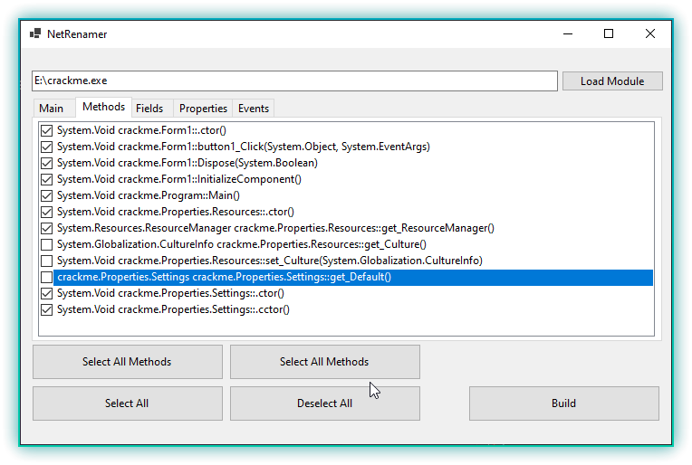

# NetRenamer
Simple tool to obfuscate/rename .NET module's methods, fields, classes and more using [AsmResolver](https://github.com/Washi1337/AsmResolver).

# Features
- Rename Methods, Fields, Properties, Events, Classes.
- Change Module's name and version.
- Add custom watermark to renaming.
- Exclude specific types to not rename.
  
# UI

# Credits
- [AsmResolver](https://github.com/Washi1337/AsmResolver) - (Washi)